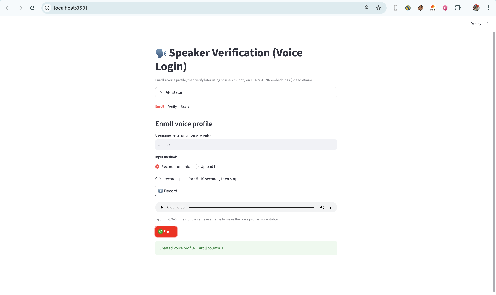
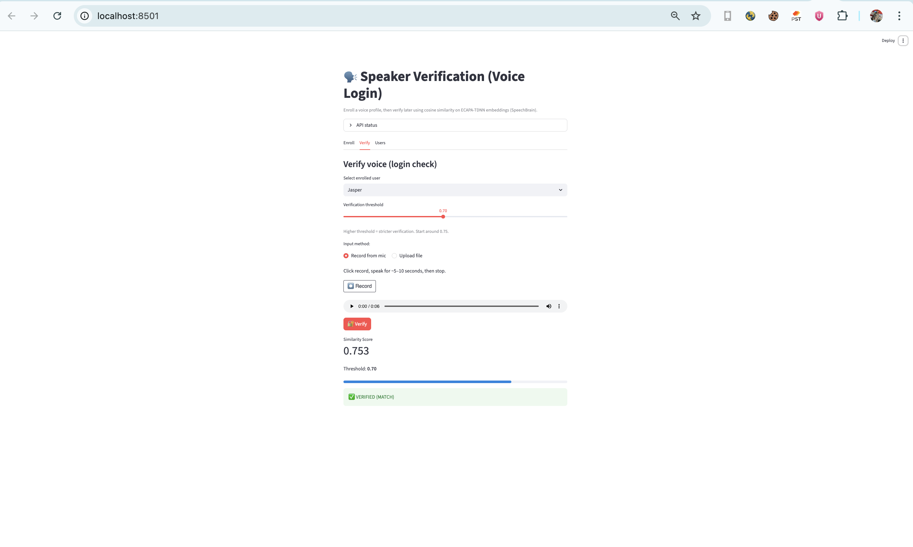
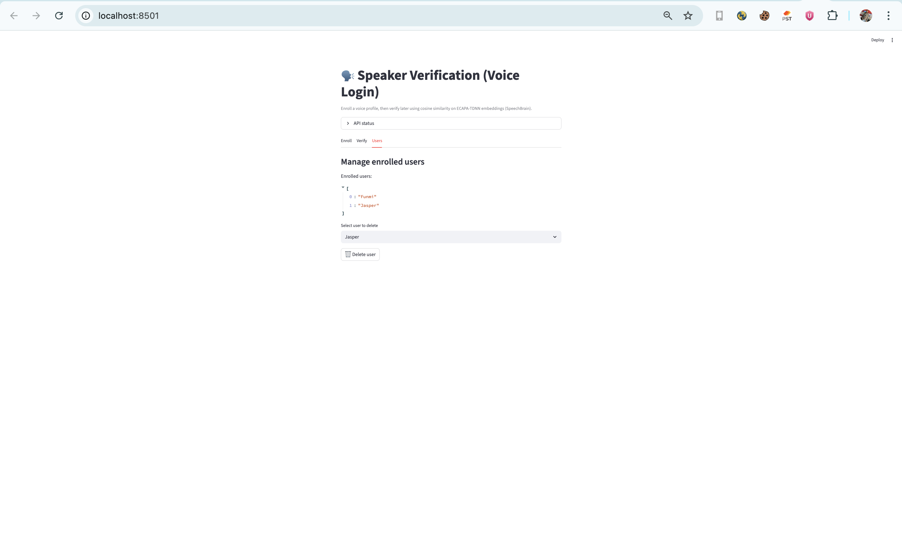

# 🗣️ Speaker Verification (Voice Login)
Voice Authentication System using FastAPI, Streamlit & SpeechBrain

 This is a **biometric voice authentication system** that verifies whether two voice samples belong to the same speaker.  
Users can **enroll a voice profile** and later **verify their identity** using voice alone.

This project is **Project #2** in my **Voice AI Portfolio**, following Project #1 (Speech-to-Text).

## FEATURES

- Voice enrollment (create a voice profile)
- Voice verification (login check)
- Cosine similarity scoring
- Adjustable verification threshold
- Microphone recording or audio file upload
- User management (list & delete enrolled users)
- Clean separation of API and UI
- CPU-friendly (no GPU required)

## SCREENSHOTS

### Voice Enrollment  

### Voice Verification  

### User Management  

## PROBLEM

Traditional authentication methods (passwords, PINs, OTPs) are:
- Easy to forget
- Vulnerable to phishing
- Poor user experience

Voice biometrics provides a **natural and secure alternative**, but many examples online are academic and not usable as real systems.

## SOLUTION

This project implements a **real-world speaker verification pipeline**:

- A backend API that handles enrollment and verification
- A frontend UI for user interaction
- A pretrained deep-learning speaker encoder
- A similarity-based decision system (MATCH / NO MATCH)

The result is a practical **voice login system** similar to those used in banking and call centers.

## ARCHITECTURE

User (Browser)  
→ Streamlit Frontend  
→ FastAPI Backend  
→ SpeechBrain ECAPA-TDNN Model  
→ Voice Embedding  
→ Cosine Similarity  
→ VERIFIED / NOT VERIFIED

## MODEL CHOICE

SpeechBrain ECAPA-TDNN (VoxCeleb pretrained)

Why this model:
- Industry-standard for speaker verification
- High accuracy on unseen speakers
- Pretrained and production-ready
- Efficient on CPU
- Widely used in research and industry

## TECH STACK

Language: Python 3.10  
Frontend: Streamlit  
Backend: FastAPI  
Model: SpeechBrain (ECAPA-TDNN)  
Audio: Torchaudio, SoundFile  
Math: NumPy  
Storage: File-based embeddings  

## HOW VERIFICATION WORKS

1. Convert audio into a speaker embedding (voiceprint)
2. Store the embedding during enrollment
3. Extract a new embedding during verification
4. Compute cosine similarity between embeddings
5. Compare similarity against a threshold

Example:

Similarity score: 0.82  
Threshold: 0.75  
Result: VERIFIED

## RUN LOCALLY

Create environment

conda create -n voice_lab python=3.10 -y  
conda activate voice_lab  

Install dependencies

pip install -r requirements.txt  

Start FastAPI backend (port 8003)

export KMP_DUPLICATE_LIB_OK=TRUE  
python -m uvicorn api.main:app --host 127.0.0.1 --port 8003  

API endpoints

http://127.0.0.1:8003/health  
http://127.0.0.1:8003/docs  

Start Streamlit frontend

streamlit run app/Home.py  

Web interface

http://localhost:8501

## RESULTS

- Accurate speaker verification on clean recordings
- Clear similarity scores for transparency
- Suitable for demos and portfolio use

## CURRENT LIMITATIONS

- No anti-spoofing (deepfake protection)
- Single averaged embedding per user
- No persistent database (file-based storage only)
- No multi-speaker enrollment sessions

These are addressed in future upgrades.

## PLANNED IMPROVEMENTS

- Anti-spoofing / liveness detection
- Multiple enrollment samples per user
- SQLite database for user profiles and logs
- Confidence visualization and analytics
- Deployment to cloud platforms

## PORTFOLIO CONTEXT

This is **Project #2** in my Voice AI Portfolio.

Projects so far:

Project 01 – Speech-to-Text Web App  
Project 02 – Speaker Verification (this project)  
Project 03 – Keyword Spotting  
Project 04 – Speaker Diarization  
Project 05 – Accent Classification  

## **Contact Information**

**Author: Jasper Chinedu Nwangere**

**Email: sparobanks@gmail.com**

**[LinkedIn](https://www.linkedin.com/in/sparobanks/)**

----------------------------------------------------------------

WHY THIS PROJECT MATTERS

This project demonstrates:
- Applied biometric authentication
- Voice embedding extraction
- Similarity-based decision systems
- Secure AI system design
- Turning ML models into usable products

This is not a demo notebook — it is a **working voice authentication system**.
