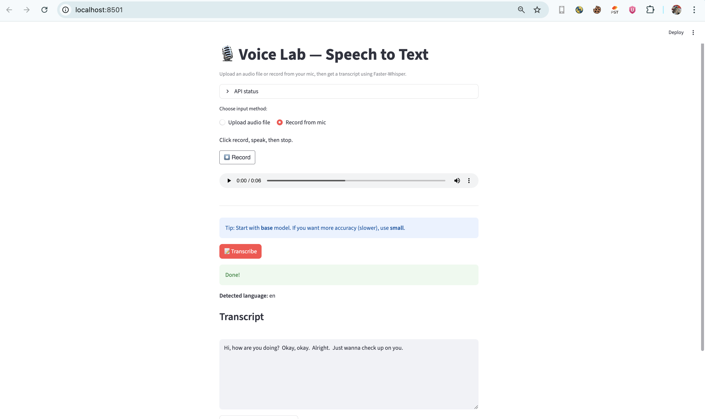
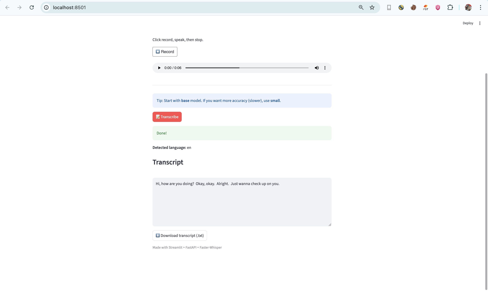

 ## Speech-to-Text Web App (FastAPI + Streamlit + Faster-Whisper)

Voice Lab is a **production-style speech recognition web application** that converts spoken audio into text using modern deep-learning models.  
It supports **audio file upload and live microphone recording**, delivered through a clean **FastAPI + Streamlit** architecture.

This project is **Project #1** in my **Voice AI Portfolio**.

## Features
- Upload audio files (`wav`, `mp3`, `m4a`, `aac`, `ogg`)
- Record audio directly from microphone
- Automatic language detection
- Fast and accurate speech-to-text transcription
- Download transcript as `.txt`
- REST API + Web UI separation
- CPU-friendly (no GPU required)

## Demo Screenshots

User Interface – Screenshot 1

Screenshot 2 

---------------------------------------
## Problem
Many speech-to-text examples:
- Work only in notebooks
- Are difficult to demo or deploy
- Do not expose real APIs
- Break easily across operating systems

They often show *models*, not **systems**.

## Solution
Voice Lab demonstrates **how speech recognition systems are built in practice**:

- A dedicated **backend API** for transcription
- A simple **frontend UI** for real users
- A stable, production-ready ASR engine
- Clear separation between model, API, and UI

This mirrors real-world AI deployment patterns.

### Why Faster-Whisper?
- Faster inference than OpenAI Whisper
- More stable on macOS and Linux
- Avoids NumPy / LLVM dependency issues
- Widely used in production ASR systems

## Tech Stack

| Layer | Technology |
|-----|-----------|
| Language | Python 3.10 |
| Frontend | Streamlit |
| Backend | FastAPI |
| ASR Engine | Faster-Whisper |
| Audio | FFmpeg, SoundFile, PyDub |
| Runtime | CPU (GPU optional) |

## How to Run Locally

### 1. Create environment

conda create -n voice_lab python=3.10 -y  
conda activate voice_lab  

### 2. Install dependencies

pip install -r requirements.txt  

### 3. Start FastAPI backend

export KMP_DUPLICATE_LIB_OK=TRUE  
python -m uvicorn api.main:app --host 127.0.0.1 --port 8002  

API endpoints

http://127.0.0.1:8002/health  
http://127.0.0.1:8002/docs  

### 4. Start Streamlit frontend

streamlit run app/Home.py  

Web interface: http://localhost:8501

----------------------------------------------------------------

## RESULTS

- Accurate transcription for clean and noisy audio
- Supports multiple audio formats

## PLANNED IMPROVEMENTS

- Word-level timestamps
- Speaker diarization (who spoke when)
- Speaker verification (voice login)
- Transcript history using SQLite
- Cloud deployment (Hugging Face Spaces and Railway)
  
-----------------------------------------------------------------
### WHY THIS PROJECT MATTERS

This project demonstrates real-world AI system design, API-driven machine learning deployment, environment debugging, and turning deep-learning models into usable products.

This is not just a model — it is a working AI application.

----------------------------------------------------------------

## **Contact Information**

**Author: Jasper Chinedu Nwangere**

**Email: sparobanks@gmail.com**

**[LinkedIn](https://www.linkedin.com/in/sparobanks/)**

